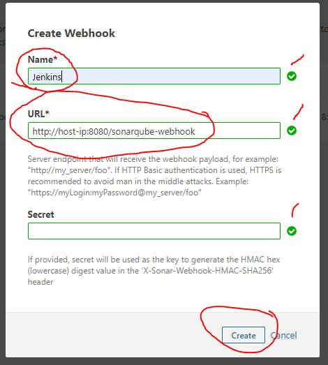

# Docker Compose Examples

This is a reference project that hopes to provide easy examples of Docker Compose files. 

## CI/CD with Jenkins and SonarQube

Examples:
 - [jenkins_blueocean/docker-compose.yml](./jenkins_blueocean/docker-compose.yml)
 - [sonarqube_postgre_sql/docker-compose.yml](./sonarqube_postgre_sql/docker-compose.yml)

*ensure you have already installed Docker, DockerCompose, and Git*

How to use these files? Simply download the compose files into seperate folders, taking care to place them somewhere where you want data to persist (or adjust volumes correctly). Open a terminal  and navigate to the target directory and run:

```bash 
docker-compose up
```

Windows example
```powershell
cd <drive>:\<git file directory>\jenkins_blueocean\
docker-compose up
```

Open another terminal

```powershell
cd <drive>:\<git file directory>\sonarqube_postgre_sql\
docker-compose up
```

### Connecting Jenkins to SonarQube, and SonarQube to Jenkins

Step #1 - Adding the plugin and updating the project files (assumes [Jenkins ver. 2.190.3](https://jenkins.io/changelog/) or later with Blueocean). Your new Jenkins server should be running at http://localhost:8080 unless you changed the [docker-compose.yml](./jenkins_blueocean/docker-compose.yml)

  - Open Jenkins administration 
  - Go to ```Manage Jenkins > Configuration``` and scroll to ```SonarQube Servers``` section
  
  - Click "Add SonarQube" button if the screen isn't showing the fields above
  - using "ipconfig" on Windows, or "ifconfig" on Linux, get your computers ("HOST") ip address and add it to the "**ServerURL**" field as shown: *http://host-ip:9000* where "**host-ip**" is your systems ip address

  - Now click "Advanced" button under "Server Authentication" token 
   You should see "Webhook Secret", we'll need to get the token from SonarQube to add here, open a new browser window to http://localhost:9000 

Step #2 - Generating the Webhook Key from Sonar. Your new server should be at http://localhost:9000 unless you changed the [docker-compose.yml](./sonarqube_postgre_sql/docker-compose.yml)

  - Click the "Login" button, default user is "admin" and password is "admin" (you'll want to change this eventually)
  

  - Once you've logged in, you should see a new "Administration" tab in the menu, click on that and then click "Configuration" to view the "Webhooks" menu item and click it 

  - On the "Webhooks" page, click "Create" button 
  

  - a "Create Webhook" pop up should appear. Fill "Name" field with "Jenkins", "URL" field with Jenkins web address (http://host-ip:8080/sonarqube-webhook) and leave "Secret" blank for now and finally click "Create"    
  

  - you should now see a new "Jenkins" webhook on the "Webhooks" page
  

Step #3 - Generating SonarQube token and adding it to Jenkins
  - Click on the "Administator" button in the top right of the page and select "My Account"
  

  - Now click the "Security" tab, Type "Jenkins" in the "Enter Token Name" field, "Generate" button will become enabled so just click it
  

  - a new Token will be generated, make sure to copy it now, it won't be visible again, place it in a secure location, you will need to put this in the "Token" field for Jenkins from the end of Step #1
  

  - Go back to the ```Jenkins > Manage Jenkins> Configuration > SonarQube Servers > Advanced > Server Authentication``` from the last part of Step #1 and click "Add"
  

  - select "Docker Host Certificate Authentication" from "Kind" and click "Add"  in "Client Key"
  
  For more info on "tokens",  see [Sonar docs](https://docs.sonarqube.org/latest/user-guide/user-token/)

Step #4 - Update your Jenkinsfile for your git project to include the apropriate SonarQube call.

Example: within a proejct you need to add a Jenkinsfile to provide the settings to Jenkins new "Pipeline" system, here is a snippet from one

```javascript
stage('Sonarqube') {
      environment {
        scannerHome = tool 'SonarQubeScanner'
      }
      steps {
        withSonarQubeEnv('sonarqube') {
          sh "${scannerHome}/bin/sonar-scanner"
        }
        timeout(time: 30, unit: 'MINUTES') {
          waitForQualityGate abortPipeline: true
        }
      }
    }
```

Important things to note are "**SonarQubeScanner**" must match the settings in Global Configuration in Jenkins, as well as "**sonarqube**" as the name of the server. The rest should just work. Example Jenkinsfile is in the [support_files](./support_files/Jenkinsfile) as well as in the example project [DiceRoller](https://github.com/JENkt4k/DiceRoller) which uses a Android Docker container to build a Google example app.